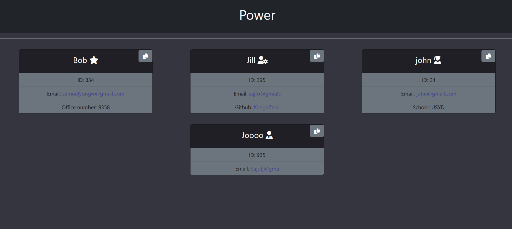
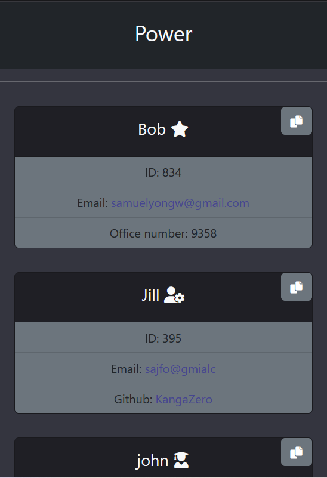

# <Team-Profile-Generator>

## Team Profile Generator
<a id="readme-top"></a>

<!-- TABLE OF CONTENTS -->
<details>
  <summary>Table of Contents</summary>
  <ol>
    <li><a href="#description">Description</a></li>
    <li><a href="#installation">Installation</a></li>
    <li><a href="#license">License</a></li>
    <li><a href="#contact">Contact</a></li>
    <li><a href="#acknowledgments">Acknowledgments</a></li>
  </ol>
</details>


<!-- ABOUT THE PROJECT -->
## Description
<details> <summary>Desktop View</summary>



</details>

<details><summary>Mobile View</summary>

<p align="center">

</p>

</details>

**What?**

This is a <strong>Team Profile Generator</strong> made using Node js, and 3rd party NPMs. This repository has been arranged with the OOP(Object-Oriented Programming) design. There are also test intregrated using Jest for each class (properties, and methods). Using "Inquirer (3rd-parth npm)", when the user runs the program on the terminal, a series of questions will be asked; depending on the input received, a HTML file will be generated according to said inputs. The HTML file also includes responsive and aesthetic elements using Boostrap CSS, JQuery and vanilla Javascript. 

**Technologies used**

- Javascript
- HTML
- Node js

<strong>NPMs:</strong>
- Inquirer
- Jest
- FontAwesome (unused on Javascript)

<strong>3rd-Party Libraries:</strong>
- BootStrap
- FontAwesome
- JQuery


**Acquired Knowledge**

With the way of designing code in an OOP fashion, and the use of classes, and test(jest) being new to me, I am still not confident in any of them, but I have understood their purpose and intergration in this project. 

Test are still slightly alien to me, especially when mocks are integrated. Unfortunately, I did not include mocks (could be used for fetch) as I could not figure out within the given timeframe on how to use it. 

I am however, more confident for the rest, especially Inquirer and how to format the questions, and getting the desired information to render onto the HTML page. 

FS is another beast with so many methods shown on its documentation. I only used 2 methods (writeFile & appendFile), so I am still a novice. 

I also had to learn on how to copy to clipboard (shown in copy.js) and generating a toast (notification) with BootStrap. 

For FontAwesome I included it's npm, but I failed to render it into HTML on javascript, and stuck with using the HTML code instead. 

And lastly, JQuery, where I only used the draggable function (shown on index.html) and that was it.

<p align="right">(<a href="#readme-top">back to top</a>)</p>


<!--Installation-->
## Installation

Initialisation  
```
npm i  
```

Test (on tests folder)
```
npm run test
```

For program to run (main folder)
```
node index.js
```

<p align="right">(<a href="#readme-top">back to top</a>)</p>


<!-- LICENSE -->
## License

Distributed under the MIT License. See `LICENSE.txt` for more information.

<p align="right">(<a href="#readme-top">back to top</a>)</p>


<!-- CONTACT -->
## Contact

Samuel Wai Weng Yong - <a href="mailto:samuelyongw@gmail.com"> samuelyongw@gmail.com </a>

Project Link: [Team-Profile-Generator](https://github.com/KangaZero/Team_Profile_Generator.git)

<p align="right">(<a href="#readme-top">back to top</a>)</p>


<!-- ACKNOWLEDGMENTS -->
## Acknowledgments

Here are some of the resources used as reference to build this personal portfolio

* [Choose an Open Source License](https://choosealicense.com)
* [Font Awesome](https://fontawesome.com/v5/docs/web/use-with/wordpress/install-manually)
* [Bootstrap Toast](https://getbootstrap.com/docs/4.3/components/toasts/#:~:text=Push%20notifications%20to%20your%20visitors,easy%20to%20align%20and%20position.)
* [Jest Mock Function](https://jestjs.io/docs/mock-functions)
* [Email-tag](https://www.w3schools.com/tags/tag_address.asp)
* [JQuery Draggable Function](https://jqueryui.com/draggable/)
* [Inquirer doc](http://adilapapaya.com/docs/inquirer/)

<p align="right">(<a href="#readme-top">back to top</a>)</p>


<p align="center">Thanks for reading 😄!</p>
